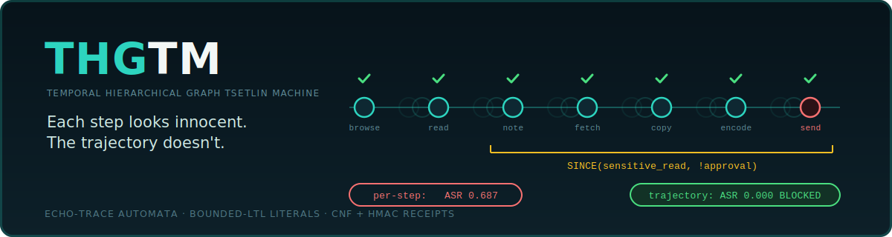

<div align="center">



<br/>

[](https://github.com/AnwarDebes/THGTM/releases)
[](pyproject.toml)
[](LICENSE)
[](tests/)
[](paper/thgtm.pdf)

**A pure-Python reference implementation of THGTM v0.1, built on a single
new primitive, Echo-Trace Tsetlin Automata (ETTA), for sequence
learning, multi-layer credit assignment, and trajectory-level
verification of agentic AI systems.**

</div>

---

The accompanying paper is at `paper/thgtm.pdf`.

## Quick start

```bash
# Install
pip install -e .

# Run the test suite (25 tests, ~15s on CPU)
pytest -q tests/

# Reproduce every paper number end-to-end (~5 minutes on CPU)
make reproduce

# Build the paper PDF
make paper
```

## What's in the box

| Path                                       | What it is |
|--------------------------------------------|------------|
| `thgtm/etta.py`                            | The Echo-Trace Tsetlin Automaton bank.  One float per TA. |
| `thgtm/tm.py`                              | Binary + multi-class TM trainer using ETTA. |
| `thgtm/hgtm.py`                            | Stacked GraphTM layers with trace-projected feedback. |
| `thgtm/temporal.py`                        | Bounded-LTL temporal literals: `PAST_k`, `SINCE`, `ALWAYS_in_window`. |
| `thgtm/receipts.py`                        | DIMACS CNF + HMAC clause receipts and trajectory composition. |
| `tests/`                                   | 25 unit tests, all green. |
| `experiments/noisy_xor.py`                 | Sanity: `lambda = 0` reduces to vanilla TM (clean NoisyXOR ≈ 0.97). |
| `experiments/temporal_xor.py`              | `PAST_k` + ETTA solves delayed XOR; isolates each contribution. |
| `experiments/depth_n_parity.py`            | Load-bearing test from HGTM's own benchmarks. |
| `experiments/trajectory_verification.py`   | Slow-roll exfiltration; per-step ASR 0.687 → trajectory ASR 0.000. |
| `scripts/make_figures.py`                  | Builds every figure used in the paper from the results JSONs. |
| `paper/thgtm.tex` (+ `references.bib`)     | The paper source.  Compiles with `pdflatex`. |
| `paper/figures/*.pdf`                      | Figures from real experiment data. |
| `results/*.json`                           | Raw per-seed experiment records. |

## Headline results

| Experiment                              | Vanilla baseline             | THGTM/ETTA                   |
|-----------------------------------------|------------------------------|------------------------------|
| Noisy-XOR (λ=0, sanity)                 | n/a                          | 0.972 ± 0.057 (canonical)    |
| Temporal-XOR k=1                        | 0.909 ± 0.129 (`PAST_k`)     | **1.000 ± 0.000**            |
| Temporal-XOR k=2                        | 0.973 ± 0.038 (`PAST_k`)     | **0.999 ± 0.001**            |
| Depth-N-Parity (path=2)                 | 0.833 ± 0.118 (L=2)          | **0.919 ± 0.114** (L=2 ETTA) |
| Slow-roll exfiltration ASR              | 0.687 ± 0.053 (per-step)     | **0.000 ± 0.000** (LTL)      |

See `paper/thgtm.pdf` for the full discussion, limitations, and honest
caveats.

## Honest limitations

This is v0.1.  We are explicit about what does and does not work:

* **No convergence proof** for trace-projected feedback.
* **Modest L≥2 uplift on depth-N parity** beyond path length 2; at
  longer path lengths the per-layer clause budget dominates.
* **Synthetic trajectory benchmark.**  The slow-roll exfiltration
  dataset is intentionally simple.  Multi-turn AgentDojo extension
  is future work.
* **ASIC memory cost not measured.**  ETTA adds one float per TA;
  whether that holds in the Newcastle 8.6 nJ/frame budget needs
  hardware co-design.
* **No DP / federated story.**  Federated ETTA aggregation with
  formal (ε, δ) is left to future work.

## Reproducing the paper end-to-end

```bash
make reproduce      # runs all four experiments, regenerates results/*.json
make figures        # rebuilds paper/figures/*.pdf from results/*.json
make paper          # compiles paper/thgtm.pdf
```

Total runtime on a single CPU: ~5 minutes for `reproduce`, a few
seconds each for `figures` and `paper`.

## License

MIT.  See `LICENSE`.

## Citing

```bibtex
@misc{debes2026thgtm,
  title  = {THGTM: A Temporal Hierarchical Graph Tsetlin Machine
            with Echo-Trace Automata for Trajectory-Level
            Verification of Agentic AI},
  author = {Debes, Anwar},
  year   = {2026},
  note   = {Reference implementation, v0.1, May 2026}
}
```
